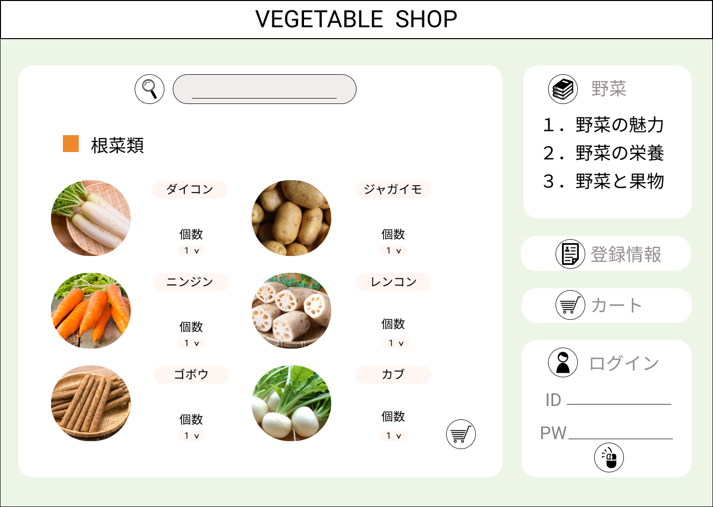
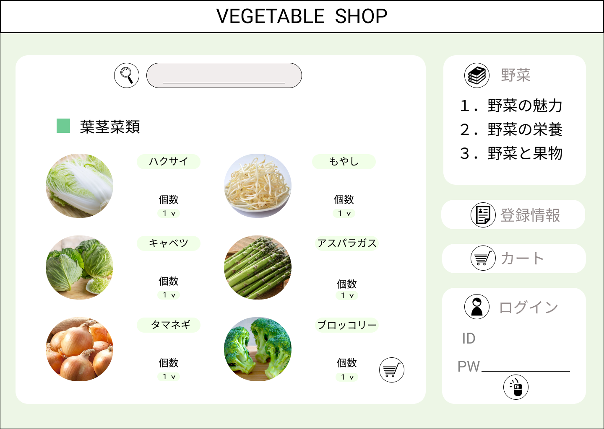
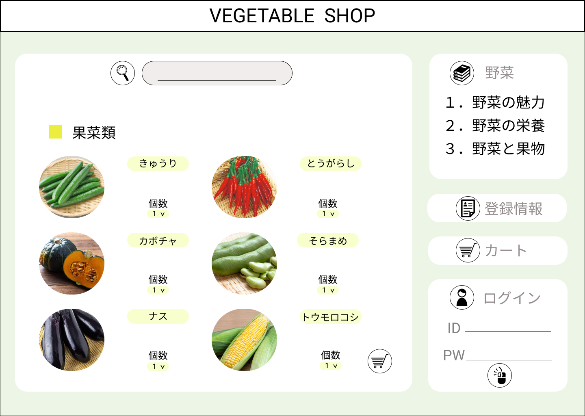
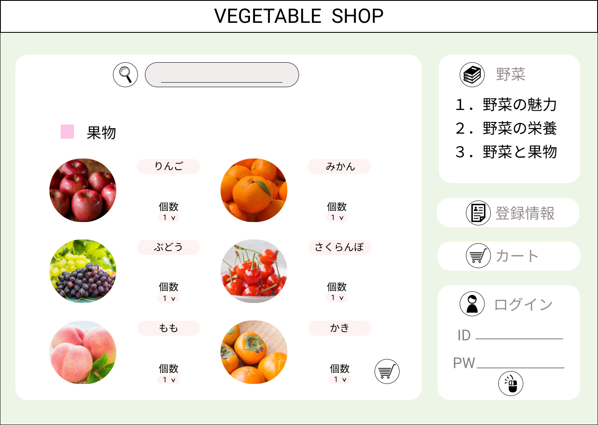

### 画面詳細図
## 商品一覧
### プロトタイプは以下のリンクの先
[プロトタイプ](https://www.figma.com/file/sYqD6oj8LLQ6RaCjpadHvR/original?node-id=0%3A1)
*****

*****
補足：対応DBの列はDB設計後、〇を対応するテーブル・カラム名に差し替えること

| ID | 要素 | 内容 | アクション | イベント | 対応DB |
|----|-----|------|----------|----------|-------|
|1   |根菜類|テキスト表示|クリック|商品一覧へ遷移|-|
|2   |根菜類|画像表示|クリック|商品一覧へ遷移|-|
|3   |葉茎菜類|テキスト表示|クリック|商品一覧へ遷移|-|
|4   |葉茎菜類|画像表示|クリック|商品一覧へ遷移|-|
|5   |果菜類|テキスト表示|クリック|商品一覧へ遷移|-|
|6   |果菜類|画像表示|クリック|商品一覧へ遷移|-|
|7   |果物|テキスト表示|クリック|商品一覧へ遷移|-|
|8   |果物|画像表示|クリック|商品一覧へ遷移|-|

### 共通部分  

| ID | 要素 | 内容 | アクション | イベント | 対応DB |
|----|-----|------|----------|----------|-------|
|1   |バナー|サイト名表示|クリック|トップページへ遷移|-|
|2   |ログイン|テキスト表示|-|-|-|
|3   |ID|入力欄|テキスト入力|-|〇|
|4   |PW|入力欄|テキスト入力|-|〇|
|5   |ログインボタン|ボタン|クリック|ログイン処理実行|-|
|6   |商品検索|入力欄|テキスト入力|-|〇|
|7   |商品検索|ボタン|クリック|検索実行処理|〇|
|8   |野菜|テキスト表示|-|-|-|
|9   |野菜1|テキスト表示|-|-|-|
|10  |野菜1|テキスト表示|ホバー|-|-|
|11  |野菜2|テキスト表示|-|-|-|
|12  |野菜2|テキスト表示|ホバー|-|-|
|13  |野菜3|テキスト表示|-|-|-|
|14  |野菜3|テキスト表示|ホバー|-|-|
|15  |カート|画像ボタン|クリック|カートへ遷移|〇|
|16  |登録情報|画像ボタン|クリック|登録情報へ遷移|〇|
